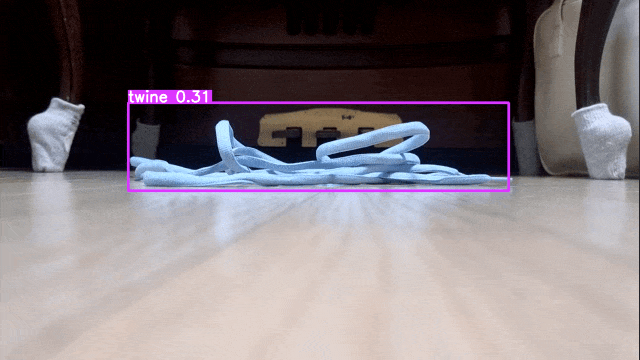

<!DOCTYPE html>
<html>
    <head>
        <meta charset="
UTF-8">
        <link rel="stylesheet" type="text/css" href="templates/readme.css" />
    </head>
    <body>
    <h1>로봇청소기를 위한 소형객체 탐지 모델</h1>
    <h2>프로젝트 개요</h2>
    <table>
        <tr>
          <th>기간</th>
          <td>2023.07.17 ~ 2023.08.09 (총 25일)</td>
        </tr>
        <tr>
          <th>인원구성</th>
          <td>고혜령 문성우 박태휘 윤필성용</td>
        </tr>
        <tr>
          <th>프로젝트 목표</th>
          <td>기존의 로봇 청소기가 탐지하지 못해서 고장 원인이 되는 특정 소형 객체에 대한 인식률을 높이는 것이 본 프로젝트의 핵심 목표입니다.</td>
        </tr>
        <tr>
          <th>프로젝트 내용</th>
          <td>팀 프로젝트로, 로봇청소기의 실시간 장애물 감지를 위해 YOLOv8 모델을 활용하여 정확도 대비 속도가 우수한 객체인식 기술을 학습하고,   모델 구동이 소형 하드웨어에서 이루어질 것을 감안하여 성능을 보장하는 소형 모델 탐색의 필요성을 학습하였습니다.</td>
        </tr>
        <tr>
          <th>개발환경   (클라우드)</th>
          <td> <code>CLOUD</code> Google Colab Pro+ (V100 / A100)   <code>OS</code>  Linux(Ubuntu 18.04.6 LTS)   <code>CPU</code> Intel Xeon   <code>GPU</code> V100 / A100   <code>RAM</code> 40GB</td>
        </tr>
        <tr>
          <th>사용 언어 및   기술 스택</th>
          <td> <code>Language</code> Python   <code>Editor</code> VSCode, Pycharm   <code>Modeling</code> Tensorflow, Pytorch, Pytorch Lightning, Huggingface   <code>CV</code> OpenCV(python), Albumentations, torchvision   <code>Logging</code> WandB, Tensorboard </td>
        </tr>
    </table>
         
        <h2>과정 및 결과</h2>
        <h3>데이터 수집</h3>
        <h4>1) 데이터 수집 배경</h4>
        <aside class="callout">
            🧹 <strong> <code><strong>참고자료</strong></code> Ecovacs Robotics사의 로봇청소기용 딥러닝 모델 개발 후 포스트</strong>
            

                
                <em>출처: https://blog.tensorflow.org/2020/01/ecovacs-robotics-ai-robotic-vacuum.html</em>
            

            <blockquote>
                대량의 데이터 없이 딥러닝 모델을 구축하는 것은 설계도 없이 집을 짓는 것과 같습니다.  
                <strong>독특한 지상 시점과 흔하지 않은 객체 카테고리</strong>로 인해 저희의 요구에 맞는 공개 데이터 세트를 찾을 수 없었습니다.   
                그래서 우선 여러 기관과 협력하여 전 세계의 데이터를 수집했습니다.
            </blockquote>
        </aside>
        

            AI-Hub 등 국내외에서 접근 가능한 데이터셋 웹사이트에서도 가정용 로봇청소기 시점에서 촬영된 물체에 대한 데이터셋은 찾을 수가 없었습니다.   
            이에 따라 직접 데이터를 수집하기로 결정하였습니다.
        

        

        <h4>2) 데이터 수집 기준 수립</h4>
        
<strong>1. 수집항목 설정</strong>

        

            

                
                <em>삼성전자 서비스센터의 로봇청소기 점검코드</em>
            

            

              
              <em>삼성전자 BESPOKE 제트 봇 AI 공식 매뉴얼</em>
            

        

        
제한된 시간 및 자원 내에서 목표를 달성하기 위해 객체(라벨)의 수를 한정해서 수집하기로 했습니다. 기존 고급형 로봇청소기의 점검코드나 사용설명서, 사용자 리뷰 등을 참고하여,

        <ul>
          <li>흡입 불가능한 장애물</li>
          <li>흡입 가능한 장애물 중 가늘고 긴 장애물</li>
          <li>흡입 가능한 장애물 중 가늘고 길지 않은 장애물</li>
        </ul>
        
로 기준을 나누어 로봇청소기 고장의 주요 원인이 되는 객체를 선정했습니다. 또한 기능의 차별화를 위해

        <li>귀중품</li>
        
항목의 데이터도 수집하기로 결정했습니다.

        
<strong>2. 촬영기준 수립</strong>

        
카메라: <code>위치</code>는 바닥에 바짝 붙여서, <code>촬영 각도</code>는 바닥에서 수직으로.

        <table>
          <th>각도</th>
          <th>상태</th>
          <th>거리</th>
          <tr>
            <td>물체를 중심으로 360' 회전</td>
            <td>물체를 바르게 놓은 상태</td>
            <td>근거리(물체가 화면에 비치는 길이의 절반)</td>
          </tr>
          <tr>
            <td></td>
            <td>물체를 뒤집은 상태</td>
            <td>중거리</td>
          </tr>
          <tr>
            <td></td>
            <td>기타 다양한 상태</td>
            <td>장거리(약 30cm 지점)</td>
          </tr>
        </table>
        

          여럿이서 데이터를 수집할 때 데이터의 일관성을 확보하고, 위에서 설정했던 목표 태스크에 적합한 데이터를 얻기 위해 팀원들 간에 확실한 촬영 기준을 수립하여 진행했습니다. 가정용 로봇청소기의 시점을 재현하기 위해 카메라의 위치와 각도를 설정하고, 충분한 일반화를 위해 최대한 다양한 시점/거리에서 다양한 상태의 객체를 촬영하고자 했습니다.
        

        <h4>3) 데이터 수집 결과</h4>
        
        

          

            
          

          

            <h5>데이터 수집량이 적은 경우</h5>
            <li>다양한 형태 및 가짓수가 존재하지 않는 물체(바늘 등)</li>
            <li>주변에서 구하기 어려운 물체(미니 리모컨 등)</li>
              
            <h5>데이터 수집량이 많은 경우</h5>
            <li>일반화 성능을 확인하기 위해 집중적으로 다양성을 확보한 물체(손목시계)</li>
            <li>주변에서 구하기 쉬운 물체(반지 등)</li>
          

        

        <h4>4) 데이터 정제</h4>
        
수집한 데이터는 Roboflow를 이용해 수작업으로 annotation을 진행하였습니다.

        <li>Roboflow를 이용해 annotation 진행
          

            

            

          

        </li>
         
        <li>데이터 제외 기준: 잔상이 심한 객체 및 잘린 객체
          

            

              
              <em>잔상이 심한 객체</em>
            

            

              
              <em>잘린 객체</em>
            

          

        </li>
        

        <h3>데이터 증강(Augmentation)</h3>
        여전히 부족한 데이터를 확충하기 위해, 다음의 2가지 주요 데이터 증강 기법을 사용했습니다.
        <h4>1) BoundingBox Color Jittering</h4>
        <code>문제상황</code> 저희 모델은 다양한 가정에서 다양한 객체를 탐지해야 하기에 일반화가 매우 중요하지만, 모든 객체에 대해 모든 색상의 데이터를 수집하는 것은 비용적 한계가 크다고 판단했습니다.
        <code>솔루션</code> 저희는 추가 데이터 수집 없이 색상에 대한 일반화를 달성하기 위해 <strong>BoundingBox Color Jittering</strong> 알고리즘을 직접 고안하여 구현했습니다. 
          
        Roboflow, Albumentation 등에서 제공하는 기존의 color augmentation 기법은 배경을 포함한 이미지 전체의 색상을 변경하지만, 저희가 적용한 BoundingBox Color Jittering은 bounding box 안의 객체를 타겟팅하여 색상을 변경함으로써 동일한 배경에 다양한 색상의 객체가 들어온 것과 유사한 효과를 낼 수 있습니다. 또한 단순 색조/채도 조정으로 변경할 수 없는 검은색, 흰색 객체도 색상 변경이 가능합니다.
          
        <li><strong>기술 상세</strong></li>
        <table>
          <th>적용 대상</th>
          <th>혼합 방식</th>
          <th>설명</th>
          <tr>
            <td>색상이 있는 객체</td>
            <td>Hue</td>
            <td>이미지를 HSV로 변환한 다음, Hue 채널의 각 픽셀에 변경하길 원하는 색조 폭만큼의 값을 더하고 0~180 사이의 값으로 정규화합니다. 이 과정에서 연산량을 줄이기 위하여 OpenCV의 LUT 함수를 활용했습니다. 색상이 있는 객체의 색상을 변경하는 데 유효하지만, 흰색이나 검은색 객체에는 효과적이지 않습니다.</td>
          </tr>
            <td>흰색 객체</td>
            <td>Multiply</td>
            <td>단일 색상의 이미지와 혼합(blend)하되, 원본 이미지와 색상 이미지의 각 픽셀 값을 0~1 사이로 정규화하여 element-wise하게 곱합니다. 이런 방식을 취하면 밝은 색은 곱하는 색만큼 어두워지고 검은색은 영향을 받지 않게 됩니다. 따라서 흰색 객체의 색상을 변경하는 데 유효합니다.</td>
          <tr>
            <td>검은색 객체</td>
            <td>Lighten Only</td>
            <td>단일 색상의 이미지와 혼합(blend)하되 두 이미지의 픽셀 중에 더 밝은 값만을 선택하는 방식입니다. 따라서 검은색 객체의 색상을 변경하는 데 유효합니다.</td>
          </tr>
        </table>
          
        <li><strong>적용 모습</strong></li>
        

          

            
            <em>흰 신발끈 데이터 원본</em>
          

          

            
            <em>좌측의 원본을 6가지 색상으로 증강</em>
          

        

          
        <li><strong>적용 후 성능 개선(gif 이미지)</strong></li>
        

          

            
            <em>적용 전</em>
          

          

            
            <em>적용 후</em>
          

        

        
동일한 모델에 흰 신발끈 데이터만 학습시켰을 때와 흰 신발끈 데이터에 BoundingBox Color Jittering을 적용하여 증강한 데이터로 학습시켰을 때를 비교하면, 하늘색 신발끈이 있는 동영상에서 'shoelace'를 탐지한 프레임 수가  61에서 194로 3배 이상 증가하여 인식 성능이 월등히 향상된 것을 보실 수 있습니다.

          
        <h4>2) Horizontal Mosaic</h4>
        
<code>문제상황</code>기존의 Mosaic 기법은 4장, 9장의 이미지를 2X2, 3X3 그리드 형태의 이미지로 변환하는 효과적인 데이터 증강 기법으로 소개되었지만, 저희 프로젝트에서는 본 기법 사용 시 <strong>바닥이 아닌 위치에서 객체가 잡히는 문제가 발생했습니다.</strong>

        

          

            
            <em>mosaic4(2X2) 적용 모습</em>
          

          

            
            <em>mosaic4 적용 후 inference 시 객체를 잘못 잡는 모습</em>
          

        

          
        
<code>솔루션</code>기존의 Mosaic을 가로로만 배치하도록 (1X3) 형태로 수정했습니다.

        <li>로봇청소기가 탐지해야 할 객체는 바닥 위에 있는 객체에 한정되는 반면에 기존의 Mosaic 기법은 세로 방향으로도 이미지가 배치되어 현실과 맞지 않는 객체의 높이 정보를 학습한 것으로 판단하였고, 불필요한 높이정보를 제거하기 위해 기존의 Mosaic 기법을 수정하였습니다.</li>
        

          

            
            <em>Horizontal Mosaic(1X3) 적용 시 모습</em>
          

          

            
            <em>Horizontal Mosaic 적용 후 inference 시 잘못된 객체를 잡지 않는 모습</em>
          

        

        
그 외 적용된 기타 augmentation 기법은 YOLOv8의 기본 설정값을 따랐습니다.

         
        <h3>모델 학습 및 하이퍼파라미터 튜닝</h3>
        <h4>모델 선정(Model Selection)</h4>
        
아래 기술되는 근거에 기반하여 최종적으로 YOLOv8n을 사용했습니다.

        <ul>
          <li>선정사유</li>
          <ul>
            <li>모델 경량성</li>
            <table>
              <th>Model</th>
              <th>mAP 50-95</th>
              <th>params(M)</th>
              <th>FLOPs</th>
              <tr>
                <td>YOLOv5n</td>
                <td>28.0</td>
                <td>1.9</td>
                <td>4.5</td>
              </tr>
              <tr>
                <td>YOLOv5s</td>
                <td><strong>37.4</strong></td>
                <td>7.2</td>
                <td>18.5</td>
              </tr>
              <tr>
                <td>YOLOv8n</td>
                <td>37.3</td>
                <td><strong>3.2</strong></td>
                <td>8.7</td>
              </tr>
            </table>
             
            <li>
              하위 라벨값의 평균 
              (mAP가 낮은 하위 10개 라벨의 평균 mAP)
              <table>
                <th>Model</th>
                <th>mAP 50-95</th>
                <tr>
                  <td>YOLOv5s</td>
                  <td>0.6614</td>
                </tr>
                <tr>
                  <td>YOLOv8n</td>
                  <td><strong>0.7373</strong></td>
                </tr>
              </table>
            </li>
          </ul>
           
        </ul>
        <h4>모델 최적화</h4>
        객체의 위치, Bounding-Box의 적절한 추론은 보장되나, 클래스에 대한 추론 능력이 떨어지는 문제를 보완하기 위해 다음의 loss 관련 3가지 하이퍼파라미터(<code>cls_loss_gain</code>, <code>box_loss_gain</code>, <code>dfl_loss_gain</code>)에 대해 7회의 A/B 테스트를 거쳐 <code>cls_loss_gain</code>의 값을 0.9로 최적화시켰습니다.
        <ul>
          <li>class loss gain(COCO mAP)</li>
          <table>
            <th>모델 옵션</th>
            <th>카드 이미지(중거리)</th>
            <th>카드 이미지(근거리)</th>
            <th>동전 이미지(중거리)</th>
            <th>동전 이미지(근거리)</th>
            <tr>
              <td>baseline</td>
              <td>0.91</td>
              <td>0</td>
              <td>0.84</td>
              <td>0.6</td>
            </tr>
            <tr>
              <td>cls=0.5</td>
              <td>0.91</td>
              <td>0</td>
              <td>0.84</td>
              <td>0.6</td>
            </tr>
            <tr>
              <td>cls=0.9</td>
              <td><strong>0.97</strong></td>
              <td><strong>0.73</strong></td>
              <td>0.84</td>
              <td>0.6</td>
            </tr>
          </table>
           
          <li>box loss gain(COCO mAP)</li>
          <table>
            <th>모델 옵션</th>
            <th>카드 이미지(중거리)</th>
            <th>카드 이미지(근거리)</th>
            <th>동전 이미지(중거리)</th>
            <th>동전 이미지(근거리)</th>
            <tr>
              <td>basline</td>
              <td>0.91</td>
              <td>0</td>
              <td>0.27</td>
              <td>0.84</td>
            </tr>
            <tr>
              <td>box=7.5</td>
              <td>0.91</td>
              <td>0</td>
              <td>0.27</td>
              <td>0.84</td>
            </tr>
            <tr>
              <td>box=9.0</td>
              <td>0.91</td>
              <td>0</td>
              <td>0</td>
              <td>0.75</td>
            </tr>
            <tr>
              <td>box-1.0</td>
              <td><strong>0.87</strong></td>
              <td><strong>0.42</strong></td>
              <td><strong>0.51</strong></td>
              <td><strong>0.92</strong></td>
            </tr>
          </table>
        </ul>
        <h3>추후 개선사항</h3>
        <h4>1) 데이터 측면</h4>
        <ul>
          <li>저조도 환경을 고려한 데이터 구성 및 학습 필요</li>
          
실제 로봇청소기는 침대 밑과 같이 어두운 환경에서도 동작하나 이번 프로젝트에 활용된 촬영장비의 카메라 센서만으로는 탐지가 어려우므로 IR 센서 혹은 LiDAR 센서의 도입이 필요해보입니다.

          <li>다양한 객체에 대한 데이터 확보 필요</li>
          
색상의 다양성은 위 BoundingBox Color Jittering 기법으로 다소 해소되었으나, 형태의 다양성은 확보할 수 없었습니다. 도메인의 특수성을 고려하였을 때, 데이터 수집 단계에서 더 다양한 객체를 고려할 필요가 있습니다.

        </ul>
        <h4>2) 모델 성능 측면</h4>
        <ul>
          <li>클래스 예측 성능 개선 필요</li>
          
객체, bbox에 대한 추론 성능은 확보되었으나 라벨 혼동이 잦게 일어납니다. cls_loss_gain 값 조정을 통해 일부 해소하였으나, 여전히 class 오판 문제가 남아 있습니다. 이를 해소하기 위한 방법 강구가 필요합니다. 

        </ul>
    </body>
</html>